<h1 align="center"> Exposure Fusion </h1>

<p align="center">
Trabalho de Computação Gráfica e Multimídia acerca da técnica Exposure Fusion, de Tom Mertens
</p>

---

## Introdução

### Trabalhos relacionados

## Exposure Fusion

A fusão de exposição calcula a imagem desejada mantendo apenas as melhores partes da sequência de exposição. Esse processo é guiado por um conjunto de medidas de qualidade, que são consolidads em um mapa de peso com valor escalar.

*Regiões planas e incolores, causadas por subexposição e superexposição, devem receber pesos menores do que regiões com cores brilhantes e detalhes, por exemplo.*

Podemos pensar na sequência de entrada como uma pilha de imagens e a imagem final sendo obtida 'colapsando' a pilha através de uma mistura ponderada. As imagens devem estar perfeitamente alinhadas antes de realizar a fusão.

### Medidas de qualidade

#### Contraste 

- Para o cálculo da medida de contraste, aplica-se um filtro Laplaciano a cada imagem em escala de cinza e obtém-se um valor **C** absoluto como resposta. É uma medida que geralmente atribui um peso maior à elementos como bordas e texturas.

### Saturação

- As cores saturadas são desejáveis e tornam a imagem mais vívida. A medida de saturação **S** é calculada pelo desvio padrão dentro dos canais R, G e B, em cada pixel.

### Well-exposedness / Exposição

- Observar apenas as intensidades brutas dentro de um canal revela quão bem um pixel é exposto. Sendo assim, é desejado manter as intensidades que não sejam próximas do limite inferior (subexpostas) ou do limite superior (sobrexpostas). Cada instensidade foi ponderada com base na proximidade de 0,5 ( longe dos dois extremos) usando uma curva Gaussiana:


- Para imagens coloridas, a curva Gaussiana deve ser aplicada a cada canal separadamente e os resultados multiplicados, resultando na medida **E**.

Após encontrar as três medidas, elas são combinadas em um mapa de peso escalar usando multiplicação. Optou-se pelo uso de função exponencial para controlar a influência de cada medida:

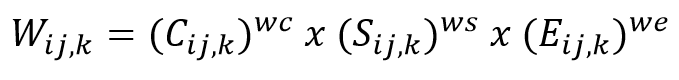

> *C, S e E referem-se ao contraste, saturação e exposição, e wc, ws e we aos seus pesos correspondentes. ij, k faz referência ao pixel (i, j) da imagem k.*

Os valores dos mapas de pesos são normalizados para que resultados consistentes sejam alcançados.

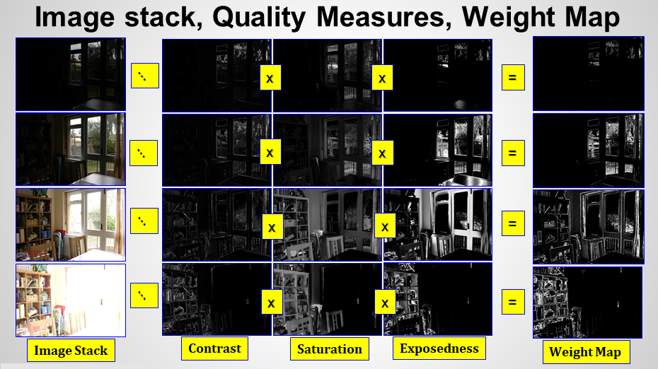

### Fusão

Para fundir as imagens, uma média ponderada ao longo de cada pixel deve ser calculada, usando os pesos obtidos a partir das medidas de qualidade.
 
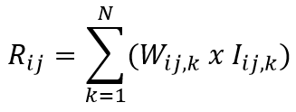

No entanto, apenas aplicando a equação acima não é possível alcançar um resultado satisfatório. Em situações em que os pesos variam rapidamente, distorções indesejáveis aparecem.

Para resolver este problema, uma técnica de outros autores, Burt e Adelson, foi utilizada. A técnica original combina perfeitamente duas imagens, guiadas por uma máscara alfa, e trabalha várias resoluções usando uma decomposição de imagem piramidal.

Em primeiro lugar, as imagens de entrada são decompostas em uma pirâmide Laplaciana, a qual contém basicamente versões passa-banda filtradas em diferentes escalas. A mistura então é realizada para cada nível separadamente. A técnica foi adaptada para este uso, onde há N imagens e N mapas de peso, que atuarão como máscaras alfa. Assim, misturamos os coeficientes de forma semelhante à primeira equação, ficando:

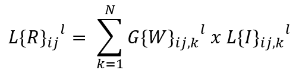

> Os níveis da pirâmide são representados por l.

Dessa forma, cada nível da pirâmide laplaciana resultante é calculado como uma média ponderada das decomposições laplacianas originais para o nível l, com o l-ésimo nível da pirâmide gaussiana do mapa de pesos servindo como máscara. Para finalizar, a pirâmide resultante é então colapsada.

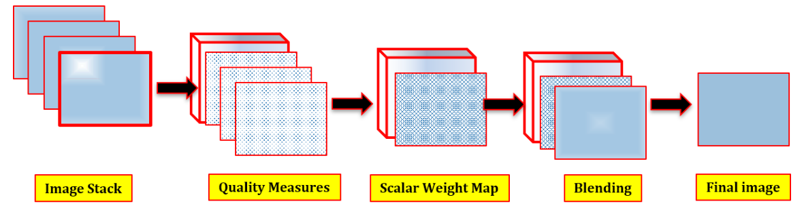

### Discussão

A forma como as imagens são misturadas é um problema frequente no que diz respeito ao processamento de imagens. Neste artigo, uma técnica de resolução baseada em pirâmides de imagens foi utilizada, no entanto outros métodos também estão disponíveis. Em particular, a mistura baseada em gradiente demonstrou ser eficaz em fusão de imagens.

## Resultados

### Qualidade

### Performance

### Incluindo exposições de flash

### Comparação de medidades de qualidade

## Conclusão

Foi proposta uma técnica capaz de fundir uma sequência de imagens com diferentes exposições em uma imagem final de alta qualidade, sem converter primeiro para HDR. Ela evita a calibração da curva de resposta da câmera, é computacionalmente mais eficiente e permite incluir imagens com exposição de flash na sequência.

A técnica combina as imagens guiada por medidas simples de qualidade, que são contraste, saturação e exposição. Isto é feito com resoluções múltiplas a fim de explicar a variação de brilho na sequência e é controlada por apenas alguns parâmetros intuitivos.

Para finalizar, o autor explicita seu desejo de investigar diferentes decomposições de imagens piramidais, como wavelets e pirâmides direcionáveis, além de examinar a aplicabilidade da técnica criada em outras tarefas de fusão de imagem, como extensão de profundida de campo e imagens multimodais.

---

## Executando o código

O código foi desenvolvido em Python e utilizamos o Jupyter Notebook para execução. Ele tem como objetivo criar uma imagem final melhorada a partir de  uma sequência de imagens capturadas com tempos de exposição diferentes, através da técnica exposure fusion.

Caso queira testar em sua máquina, siga os seguintes passos:

- Clone este repositório;
- Através do Jupyter Notebook, abra o arquivo **exposure_fusion_run.ipynb**;
- Certifique-se de que as bibliotecas utilizadas estejam instaladas em seu computador; caso não estejam, faça as instalações;
```bash
$ pip install os-sys
$ pip install opencv-python
$ pip install numpy
$ pip install matplotlib
```
- A única **modificação necessária** a ser feita é na linha destacada abaixo, na qual você deverá preencher com o caminho, em seu computador, até a pasta com as imagens que deseja realizar a fusão;
```python
path = r"C:\Users\emanu\Desktop\Projects\exposure-fusion\room"
```
- Outra possível modificação, mas não necessária, está compreendidada nesta próxima linha, onde você pode alterar o nome da imagem final a ser salva para que não sobrescreva as anteriores;
```python
cv2.imwrite('img_MultiresolutionFusion2.png', final_imageD.astype('uint8'))
```
- Feito os passos, basta rodar a aplicação. As imagens resultantes ficarão salvas na pasta **results**.

## Resultados do algoritmo

As imagens abaixo mostram os resultados obtidos ao utilizar o algoritmo proposto:

### Coleção de imagens
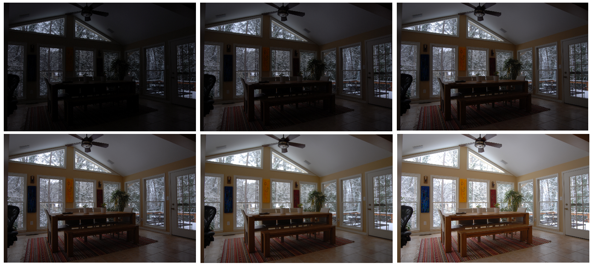
### Imagem final
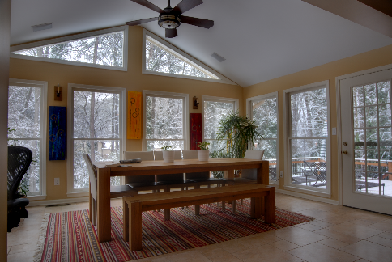

### Coleção de imagens
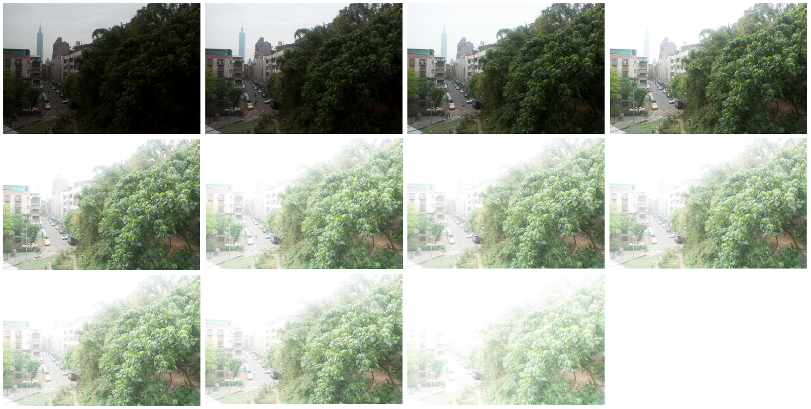
### Imagem final
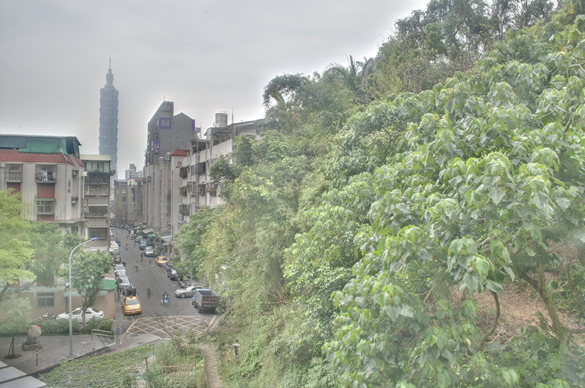

### Coleção de imagens
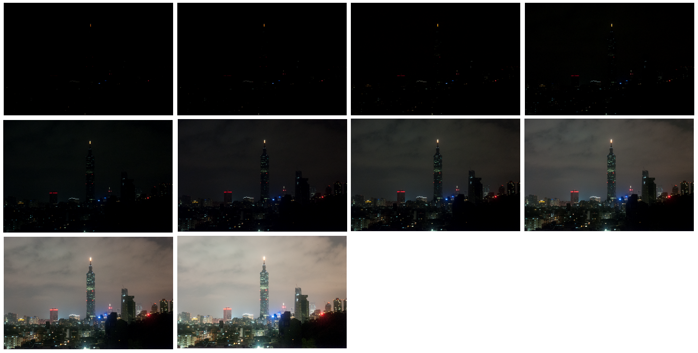
### Imagem final
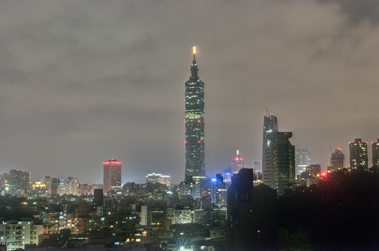

## Referências 

Mertens, Tom, Jan Kautz, and Frank Van Reeth. "Exposure fusion: A simple and practical alternative to high dynamic range photography." Computer graphics forum. Vol. 28. No. 1. Oxford, UK: Blackwell Publishing Ltd, 2009. [:page_facing_up:](https://github.com/emanuelmassafera/exposure-fusion/blob/master/exposure_fusion.pdf)

http://<span></span>github.com/kbmajeed/exposure_fusion
